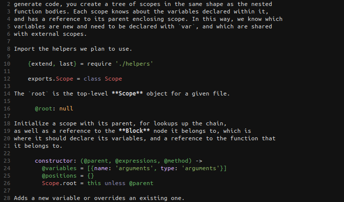

`vim-literate-coffeescript` adds syntax highlighting and indentation support for
[Literate CoffeeScript](http://coffeescript.org/#literate) to the vim text
editor.

It looks something like this:

# Dependencies

You must have syntax highlighting installed for both
[Markdown](https://github.com/tpope/vim-markdown) and
[CoffeeScript](https://github.com/kchmck/vim-coffee-script) installed to use
this package.

# Installation

## Manually

 1. Clone this repository.

        git clone https://github.com/mintplant/vim-literate-coffeescript.git

 2. Copy all the vim-specific files into your ~/.vim folder.

        cp -r vim-literate-coffeescript/ftdetect/ ~/.vim/
        cp -r vim-literate-coffeescript/indent/ ~/.vim/
        cp -r vim-literate-coffeescript/syntax/ ~/.vim/

## With Pathogen

### Setup

 1. Install [Pathogen](http://www.vim.org/scripts/script.php?script_id=2332)

 2. Change directory to your bundle folder.

        cd ~/.vim/bundle

 3. Clone this repository.

         git clone https://github.com/mintplant/vim-literate-coffeescript.git

### Updating

 1. Change directory to where the repository was cloned.

        cd ~/.vim/bundle/vim-literate-coffeescript/

 2. Pull in the latest changes.

        git pull

# License

[MIT](LICENSE)
